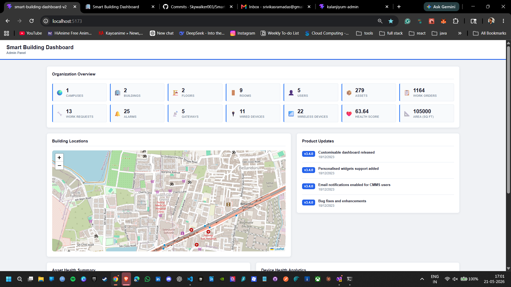
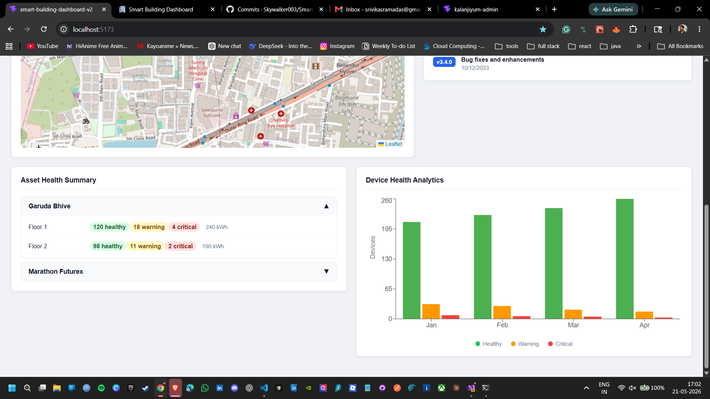

# Smart Building Dashboard

A dashboard I built to manage and monitor smart buildings. It shows building stats, device health, asset conditions, product updates, and building locations on a map.

Built with React + Vite. No UI framework used — just plain CSS.

---

## Screenshots





---

## How to run

```bash
npm install
npm run dev
```

Open http://localhost:5173

---

## What's in it

**Organization Overview** — 14 stat cards showing key numbers like devices, alarms, work orders, and a health score that changes color based on its value.

**Building Locations** — Interactive map (Leaflet + OpenStreetMap) showing where each building is. Click a marker to see building details.

**Product Updates** — A feed of release notes with version badges and dates.

**Asset Health Summary** — Accordion list of buildings. Click to expand and see floor-by-floor asset counts (healthy, warning, critical) and energy usage.

**Device Health Analytics** — Stacked bar chart showing device health month by month. Loads an error state on first visit — click Retry to load the chart.

---

## Tech used

- React 19 + Vite
- Plain CSS
- Recharts — bar chart
- React-Leaflet + Leaflet — map
- fetch API — all data comes from JSON files in /public/data/

---

## Project structure

```
src/
  components/
    Overview/
    BuildingMap/
    ProductUpdates/
    AssetHealth/
    DeviceAnalytics/
  App.jsx
  App.css
public/
  data/
```

---

## Author

Srivika Sramadas — [github.com/Skywalker003](https://github.com/Skywalker003)
